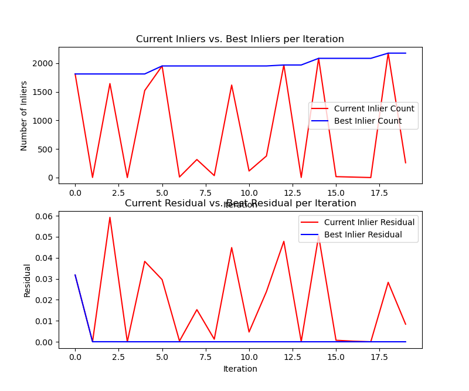
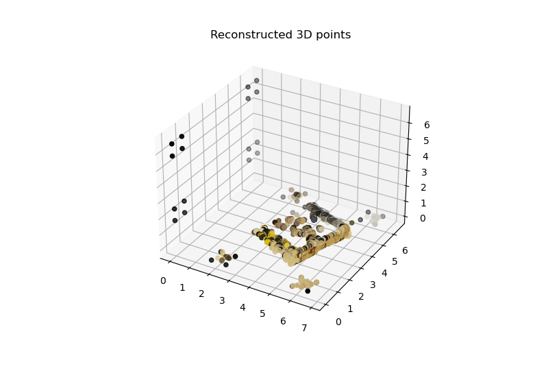

# CSCI 1430 Results Log

This log help us to grade your work; it is not a report or write up.
- Be brief and precise.
- Be anonymous.

For each homework:
- Include the homework required items.
- Report if you attempted extra credit, let us know where it is in your code, and show its results.
- Any other information that you'd like us to have in grading, e.g., anything unusual or special, please let us know.

**Make sure** to commit all the required files to Github!

## Required homework items

